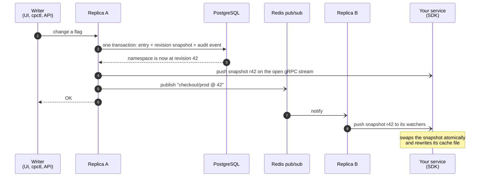

# Controlplane

**Change a config value, flip a feature flag, or tighten a rate limit once. Every service sees it in milliseconds, with no restart and no redeploy.**

Controlplane is a central service that pushes configuration, feature flags, A/B test assignments and traffic policies (rate limits and circuit breakers) to your services over gRPC streams. Every change is attributed to a person, can be rolled back in one step, and can be rolled out by percentage.

[](https://github.com/Jenil133/Controlplane/actions/workflows/ci.yml)


[Quick start](#quick-start) · [What you get](#what-you-get) · [Use it from a service](#use-it-from-a-service) · [How it works](#how-it-works) · [Concepts](#concepts) · [Security](#security) · [Deployment](#deployment) · [Performance](#performance) · [Limitations](#limitations)


<sup>The built-in admin UI. `new-cart` is in a staged rollout (5% → 25% → 50% → 100%) and is currently at 25%.</sup>

## Why

Config files and environment variables need a restart to change. Flag SDKs answer "is this on?" but not "who turned it on, and what exactly changed?". And a bad value that reaches every instance at once takes the whole fleet down with it.

Controlplane keeps one source of truth and makes changing it a safe, first-class operation.

## What you get

- **Hot reload in milliseconds.** Each service holds one long-lived gRPC stream. With 1,000 watchers across two replicas, a write reached every watcher with a p99 of **15 ms** (see [Performance](#performance)).
- **Deterministic A/B tests.** Users are bucketed by hashing their ID, so a user sees the same variant on every request and in every service, with no shared state and no network call per decision.
- **Traffic policies that change at runtime.** Token-bucket rate limits and circuit breakers are ordinary entries you edit while traffic flows. Existing limiter and breaker state survives the change.
- **Survives a control-plane outage.** The SDK keeps serving the last good configuration from memory and from an atomically written cache file, so even a service that restarts while Controlplane is down starts with its last known config.
- **Every change is attributed and reversible.** Each write creates a revision with a full snapshot and an audit event (who, when, before and after). Roll back to any earlier revision, previewing the diff first.
- **Staged rollouts.** Move a flag through stages such as 1% → 10% → 50% → 100% on timers, with pause, resume, advance and abort. Users already exposed stay exposed as the percentage grows.
- **Three ways to operate it.** A full command-line client (`cpctl`), an admin web UI, and a JSON API, on top of the gRPC contract.
- **Ready to deploy.** A Docker image, a Docker Compose stack, and Kubernetes manifests (kustomize base with dev and prod overlays) are included.
- **Observable.** Prometheus metrics, health and readiness endpoints, structured logs, and a load generator that measures write-to-delivery latency.

## Quick start

You need Go 1.25 or newer. This path uses the in-memory store, so no Docker, PostgreSQL or Redis is required.

```bash
git clone https://github.com/Jenil133/Controlplane.git && cd Controlplane
make build                                    # builds bin/controlplane, bin/cpctl, bin/cpload
export PATH="$PWD/bin:$PATH"

controlplane --store memory --log-format text # terminal 1: gRPC on :9090, admin UI and API on :8080

cpctl ns create shop/prod                     # terminal 2
cpctl flag put shop/prod new-cart --enabled --rollout 25
cpctl watch shop/prod                         # leave running

cpctl flag put shop/prod new-cart --enabled --rollout 50   # terminal 3: watch prints the change at once
```

Then open <http://localhost:8080/ui/> for the admin UI, run `cpctl history shop/prod` to see who changed what, and `cpctl rollback shop/prod 2` to preview going back (nothing is applied without `--yes`). `cpctl help` lists every command. The in-memory store forgets everything on exit; see [Deployment](#deployment) for a durable setup.

## Use it from a service

Services use the Go SDK in [`pkg/client`](pkg/client). Create a client with the server address, a namespace and optionally an API token and a cache file path. It connects in the background and returns immediately; `WaitReady` returns once a snapshot has loaded from the server or from the cache.

| You want to | Call |
|---|---|
| Read a config value | typed getters `String`, `Int`, `Float`, `Bool`, `Duration`, or `Decode` into a struct |
| Check a feature flag for a user | `IsEnabled(flag, userID)` |
| Get a user's A/B variant and its payload | `Variant(experiment, userID)` |
| Rate limit an endpoint | `Allow(key)`, or `RateLimit` for HTTP and the gRPC server interceptors, which answer 429 or `RESOURCE_EXHAUSTED` |
| Protect a dependency with a circuit breaker | `Do(key, fn)`, or the HTTP transport and gRPC client interceptor wrappers |
| React to changes | `OnChange(callback)` |
| Know how healthy the data is | `Status()`: `live` or `disconnected`, the revision, and the last error |

Every read is lock-free over an immutable snapshot that is swapped atomically when a change arrives, so reads cost nothing on the hot path. A runnable demo service is in [`examples/checkout`](examples/checkout): a flag picks the cart version, an experiment picks the button colour, a rate limit guards the endpoint and a circuit breaker wraps a simulated payments call. Its package documentation lists the `cpctl` commands that seed it, and `make example` runs it.

## How it works



- **PostgreSQL is the source of truth.** Every write bumps its namespace's revision in the same transaction that changes the entry, stores the full namespace state at that revision, and records an audit event. Writers to one namespace are serialized by a row lock, and snapshots are read under `REPEATABLE READ`, so a snapshot's revision and entries always agree.
- **Replicas are stateless.** Run as many as you like. Redis carries only small `namespace @ revision` hints between them. Delivery is best effort: a periodic reconciler (every 10 s by default) compares what each replica has pushed with what the database holds, so a lost message delays an update by at most that interval. The write path never waits on Redis.
- **Slow clients cannot hurt fast ones.** Each watcher has a latest-wins mailbox, so a slow consumer skips intermediate revisions instead of buffering them or blocking anyone else.
- **Clients reconnect on their own** with jittered exponential backoff and tell the server which revision they already hold, so a reconnect does not resend what they have.
- **Shutdown is graceful.** A stopping replica fails its readiness check first, then ends its watch streams with `UNAVAILABLE`, which makes SDKs reconnect to another replica.

## Concepts

**Namespaces and revisions.** A namespace such as `checkout/prod` groups the configs, flags, experiments, rate limits and circuit breakers of one service and environment. Every change inside it creates the next revision, which gives a total order of changes and a stable point to diff against or roll back to. Writes can carry an expected revision, and then fail instead of overwriting a change they have not seen.

**Flag evaluation.** For a unit (a user ID, an account ID, anything stable), a flag is on when it is enabled and either the unit is in its allowlist or the unit's bucket falls inside the rollout percentage. An empty unit ID is on only at 100%.

**Deterministic bucketing.** The algorithm is deliberately simple so other languages can reproduce it exactly:

| Step | Definition |
|---|---|
| bucket | `murmur3_x86_32(salt + ":" + unit, seed 0) mod 10000` |
| flag is on | `bucket < round(rollout_percent × 100)`, so the percentage has 0.01% resolution |
| experiment variant | `point = bucket × sum(weights) / 10000`; the first variant whose running weight total exceeds `point` |

The salt defaults to the entry's key, so different flags bucket users independently. Raising a percentage only adds users, never removes any. [`pkg/bucketing`](pkg/bucketing) was checked against reference MurmurHash3 implementations and freezes golden bucket values in its tests, which another language can port to prove it agrees.

**Traffic policies.** A rate limit is a token bucket (a sustained rate plus a burst capacity). A circuit breaker watches the failure rate over a rolling window and opens at a threshold once it has seen enough requests, rejects calls for the open duration, then lets a few trial calls decide whether to close again. Both are enforced locally by each client instance, so there is no network hop per request, and both reconfigure in place without losing their state.

**Staged rollouts.** A plan is a list of stages, each a percentage with an optional duration. A controller advances a stage once its duration has passed. It runs on every replica, and compare-and-set writes make each advance happen exactly once, whichever replica gets there first. A stage with no duration waits for a manual advance.

**History, audit and rollback.** `history` lists revisions, `diff` shows what changed between two of them, and `audit` filters the change log by namespace, entity, actor and time. `rollback` restores the state of an earlier revision *as a new revision*, so history is never rewritten. It previews by default, applies only with `--yes`, and pins itself to the revision it previewed, so it refuses to run over a change you have not seen. Rollouts that were active at the target come back paused.

## Interfaces

| Interface | What it offers |
|---|---|
| **`cpctl`** (command line) | everything: `ns`, `config`, `flag`, `experiment`, `ratelimit` and `breaker` (put and delete), `rollout` (start, advance, pause, resume, abort, status), `history`, `revision`, `diff`, `rollback`, `audit`, `snapshot`, `watch`, `eval` and `token generate`. `cpctl help` prints the reference. |
| **Admin UI** at `/ui/` | edit every entry type, drive rollouts, browse history with diffs, roll back with one click, search the audit log. A plain embedded page with no build step, no external requests and a strict content security policy. |
| **JSON API** | every unary RPC as `POST /api/v1/<Service>/<Method>` with a protobuf-JSON body, the same roles as gRPC, and bearer-token authentication. |
| **gRPC** | [`api/proto/controlplane/v1/controlplane.proto`](api/proto/controlplane/v1/controlplane.proto): `AdminService` for writes and history, `DistributionService` for snapshots and the `Watch` stream. Server reflection is on, so tools such as `grpcurl` work without the proto files. |


## Security

Authentication is **off by default**, and the server logs a loud warning when it is. Point `--auth-tokens-file` at a JSON file of token hashes and roles to turn it on. `cpctl token generate --name <name> --role <role>` prints a new token once, together with the entry to add to that file.

| Role | Can |
|---|---|
| `reader` | read entries, history and audit events; watch namespaces |
| `editor` | also change entries, run rollouts and roll back |
| `admin` | also create namespaces |

Only SHA-256 hashes of tokens are stored, health and reflection endpoints stay public, and a test walks every RPC to make sure none ships without an explicit role. With auth on, the actor recorded in history and audit is the token's name, not something the caller claims.

> [!WARNING]
> The server does not terminate TLS itself. Put it behind a TLS-terminating proxy, ingress or service mesh, and do not expose the gRPC or HTTP port with real tokens over plaintext on an untrusted network.

## Deployment

- **Locally with PostgreSQL and Redis.** `make compose-up` starts both with Docker Compose and `make run` starts the server against them. The same [Compose file](deploy/docker-compose.yml) has a `replicas` profile that adds two control plane replicas sharing the database and Redis.
- **Your own PostgreSQL and Redis.** Set `--database-url` and `--redis-url` (or the matching `CONTROLPLANE_*` variables). Migrations run on startup under an advisory lock, so replicas can start together, and `controlplane migrate` applies them and exits, for a pre-deploy job. Without a Redis URL each replica runs on its own and relies on the reconciler.
- **Container image.** `make docker` builds a distroless image that runs as a non-root user (65532). CI builds it on every push.
- **Kubernetes.** [`deploy/k8s`](deploy/k8s) is a kustomize base with three replicas, probes, a PodDisruptionBudget, an HPA, a hardened security context and topology spread, plus two overlays. The `dev` overlay brings its own PostgreSQL and Redis, so `kubectl apply -k deploy/k8s/overlays/dev` is enough to try it. The `prod` overlay expects an externally managed Secret named `controlplane-secrets` with the keys `database-url`, `redis-url` and `tokens.json`. `make k8s-render` writes both overlays to `dist/k8s/` to inspect. The manifests need Kubernetes 1.30 or newer, and CI renders and schema-validates both overlays.
- **Observability.** The HTTP port serves `/healthz` (the process is up), `/readyz` (the store answers) and Prometheus metrics at `/metrics`: `controlplane_watch_streams`, `controlplane_snapshots_pushed_total`, `controlplane_push_lag_seconds`, `controlplane_changes_received_total`, `controlplane_publish_failures_total`, `controlplane_grpc_requests_total` and `controlplane_grpc_request_duration_seconds`.

<details>
<summary><b>All server flags</b> (each also reads its <code>CONTROLPLANE_*</code> environment variable)</summary>

<br>

| Flag | Environment variable | Default | Purpose |
|---|---|---|---|
| `--grpc-addr` | `CONTROLPLANE_GRPC_ADDR` | `:9090` | gRPC listen address |
| `--http-addr` | `CONTROLPLANE_HTTP_ADDR` | `:8080` | JSON API, admin UI, `/metrics`, health endpoints |
| `--store` | `CONTROLPLANE_STORE` | `postgres` | `postgres` or `memory` |
| `--database-url` | `CONTROLPLANE_DATABASE_URL` | | PostgreSQL connection URL |
| `--migrate` | `CONTROLPLANE_MIGRATE` | `true` | apply migrations on startup |
| `--redis-url` | `CONTROLPLANE_REDIS_URL` | | cross-replica change events; empty runs a single replica |
| `--redis-channel` | `CONTROLPLANE_REDIS_CHANNEL` | `controlplane:changes` | pub/sub channel |
| `--auth-tokens-file` | `CONTROLPLANE_AUTH_TOKENS_FILE` | | token hashes and roles; setting it turns auth on |
| `--reconcile-interval` | `CONTROLPLANE_RECONCILE_INTERVAL` | `10s` | how often watcher state is checked against the database |
| `--rollout-interval` | `CONTROLPLANE_ROLLOUT_INTERVAL` | `5s` | how often due rollout stages advance; `0` disables the controller on this replica |
| `--shutdown-timeout` | `CONTROLPLANE_SHUTDOWN_TIMEOUT` | `15s` | grace period for in-flight requests, for gRPC and again for HTTP |
| `--log-level` | `CONTROLPLANE_LOG_LEVEL` | `info` | `debug`, `info`, `warn`, `error` |
| `--log-format` | `CONTROLPLANE_LOG_FORMAT` | `json` | `json` or `text` |

Flags win over the environment, and an empty variable counts as unset.

</details>

## Performance

Measured with the bundled load generator (`cpload`) against two replicas sharing PostgreSQL 16 and Redis, with authentication on:

| | |
|---|---|
| Watchers | 1,000 streams, split across both replicas |
| Writes | 100, one every 50 ms, alternating between replicas |
| Deliveries | 100,000, none lost and none skipped |
| Write to delivery (per watcher) | p50 **3.1 ms** · p90 5.7 ms · p99 **15.0 ms** · max 30.1 ms |
| Write to *every* watcher holding it | p50 4.1 ms · p99 15.0 ms · max 30.1 ms |

The run used a single laptop over loopback, so it measures the cost of the control plane itself rather than a network. Latency is receive time minus the time the client sent the write, both from the local monotonic clock, so it does not depend on synchronized clocks. `cpload` takes the replica addresses, the number of watchers and writes, the interval, a token and an `--slo` threshold, and exits non-zero when the p99 convergence misses it; `make loadtest` runs it.

## Design decisions

- **Push over polling.** Polling trades freshness for load, and gets worse as the fleet grows. One open stream per service makes a change visible in milliseconds and costs nothing while nothing changes.
- **Whole snapshots, not deltas.** Each push carries the namespace's full state at one revision, so a client can never apply changes out of order or miss one, and recovering from a reconnect is the same code path as the first load. The cost is that a namespace should stay modest in size; a single value is limited to 256 KiB.
- **Evaluate in the client.** Flags, experiments and policies are decided locally against the snapshot. There is no per-request call to Controlplane, no added latency, and the user ID never leaves your service.
- **Redis as a hint, never as truth.** Losing it only slows propagation to the next reconcile. The database decides what is current, and the write path never waits for Redis.
- **Compare-and-set instead of locks.** Writes may require an expected revision, and the rollout controller uses the same mechanism, so several replicas can run it without electing a leader.
- **History in the same transaction as the change.** A revision, its snapshot and its audit events commit together or not at all, so the log can never disagree with the data.

## Project layout

| Path | Contents |
|---|---|
| `api/proto/`, `gen/` | the gRPC contract (source of truth) and its generated Go code |
| `cmd/controlplane` | the server |
| `cmd/cpctl` | the command-line client |
| `cmd/cpload` | the load generator |
| `internal/model` | domain types, validation, exact-number JSON diff |
| `internal/store` | the store interface, the memory and PostgreSQL backends, and a conformance suite both must pass |
| `internal/hub` | per-namespace snapshot cache with latest-wins subscriber mailboxes |
| `internal/notify` | change events over Redis pub/sub, or in-process |
| `internal/rollout` | rollout transitions and the controller |
| `internal/server` | the `AdminService` and `DistributionService` implementations |
| `internal/auth` | tokens, roles and gRPC interceptors |
| `internal/httpapi` | the JSON API and the embedded admin UI |
| `internal/metrics` | Prometheus metrics |
| `pkg/client` | the Go SDK |
| `pkg/bucketing`, `pkg/eval` | the portable bucketing algorithm and flag and experiment evaluation |
| `pkg/ratelimit`, `pkg/breaker` | the token-bucket limiter and the circuit breaker |
| `examples/checkout` | a demo service that reacts to live changes |
| `deploy/` | the Docker Compose stack and the Kubernetes manifests |

## Development

`make test` runs the unit and end-to-end tests (the PostgreSQL ones need `CONTROLPLANE_TEST_DATABASE_URL`, or `make compose-up` followed by `make test-postgres`), `make test-race` runs them under the race detector, and `make proto` regenerates `gen/` after a change to the proto file and needs `protoc`.

CI runs `gofmt`, `go vet`, the whole suite under the race detector against PostgreSQL 16, checks that `gen/` is up to date, builds the image, and validates the rendered Kubernetes manifests. The same conformance suite runs against both store backends, including concurrent rollbacks and snapshot consistency, and the `cpctl` parsers have fuzz targets.

## Limitations

Controlplane is pre-1.0 and the API may still change.

- **No built-in TLS.** Terminate it in front of the server (see [Security](#security)).
- **Creating the same new flag at the same moment on two replicas is last-write-wins.** Updating an existing entry is safe, because it is checked against the entry's revision.
- **Snapshots are pushed whole,** so very large namespaces cost bandwidth on every change.
- **The SDK is Go only.** Other languages can use the gRPC contract and the bucketing golden values.
- **No single sign-on.** Access is by API token with three roles.

## Contributing

Issues and pull requests are welcome. Run `make test-race` before opening a pull request and add a test with any behaviour change. For store changes, extend the shared conformance suite in [`internal/store/storetest`](internal/store/storetest) so both backends are held to it.
