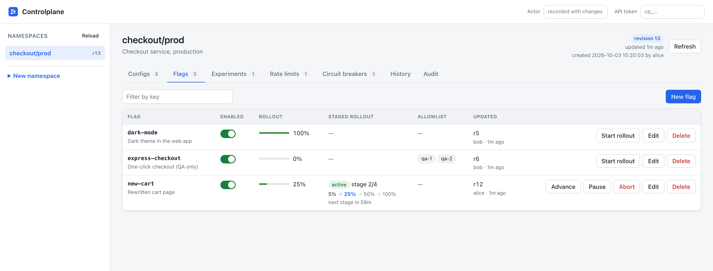
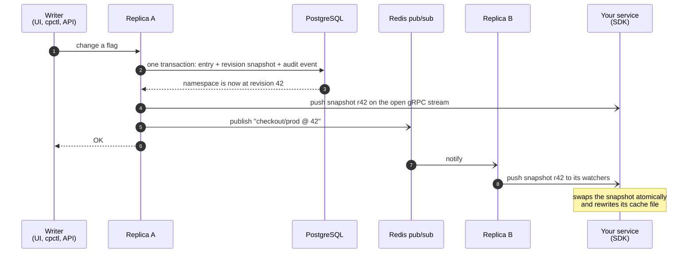
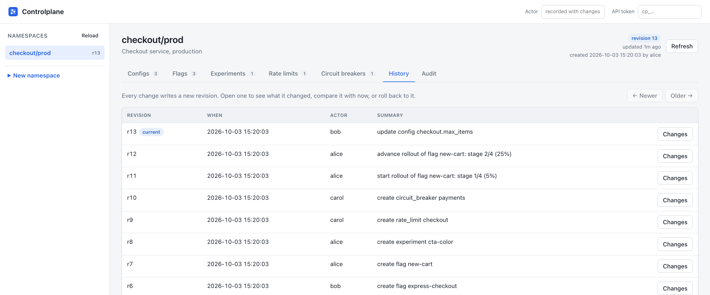

# Controlplane

**Change a config value, flip a feature flag, or tighten a rate limit once. Every service sees it in milliseconds, with no restart and no redeploy.**

Controlplane is a central service that pushes configuration, feature flags, A/B test assignments and traffic policies (rate limits and circuit breakers) to your services over gRPC streams. Every change is attributed to a person, can be rolled back in one step, and can be rolled out by percentage.

[](https://github.com/Jenil133/Controlplane/actions/workflows/ci.yml)


[Quick start](#quick-start) · [Use it from a service](#use-it-from-a-service) · [How it works](#how-it-works) · [Concepts](#concepts) · [Security](#security) · [Production](#running-in-production) · [Performance](#performance) · [Limitations](#status-and-limitations)


<sup>The built-in admin UI. `new-cart` is in a staged rollout (5% → 25% → 50% → 100%) and is currently at 25%.</sup>

## Why

Config files and environment variables need a restart to change. Flag SDKs answer "is this on?" but not "who turned it on, and what exactly changed?". And a bad value that reaches every instance at once takes the whole fleet down with it.

Controlplane keeps one source of truth and treats changing it as a first-class, safe operation:

- **Hot reload in milliseconds.** Each service holds one long-lived gRPC stream. In a test with 1,000 watchers across two replicas, a write reached every watcher with a p99 of **15 ms** ([details](#performance)).
- **Deterministic A/B tests.** Users are bucketed by hashing their ID, so a user sees the same variant on every request and in every service, with no shared state and no network call per decision.
- **Traffic policies that change at runtime.** Token-bucket rate limits and circuit breakers are ordinary entries you can edit while traffic flows. Existing limiter and breaker state survives the change.
- **Survives a control-plane outage.** The SDK keeps serving the last good configuration from memory and from an atomically written cache file, so even a service that restarts while Controlplane is down comes up with its last known config.
- **Every change is attributed and reversible.** Each write creates a revision with a full snapshot and an audit event (who, when, before and after). Roll back to any earlier revision, previewing the diff first.
- **Staged rollouts.** Move a flag through stages such as 1% → 10% → 50% → 100% on timers, with pause, resume, advance and abort. Users already exposed stay exposed as the percentage grows.

## Quick start

You need Go 1.25 or newer. This path uses the in-memory store, so no Docker, PostgreSQL or Redis is required.

```bash
git clone https://github.com/Jenil133/Controlplane.git
cd Controlplane
make build                       # builds bin/controlplane, bin/cpctl and bin/cpload

# Terminal 1: start the server (gRPC on :9090, admin UI and JSON API on :8080)
./bin/controlplane --store memory --log-format text
```

```bash
# Terminal 2: create a namespace, add a flag and a config value, then watch it
export PATH="$PWD/bin:$PATH"
cpctl ns create shop/prod
cpctl flag put shop/prod new-cart --enabled --rollout 25
cpctl config put shop/prod payments.timeout 2s
cpctl watch shop/prod            # leave this running
```

```bash
# Terminal 3: change the rollout to 50%
cpctl flag put shop/prod new-cart --enabled --rollout 50
```

Terminal 2 prints the new snapshot as soon as the write commits. The last column is the time from commit to arrival:

```text
15:26:06.979  shop/prod revision=4 configs=1 flags=1 experiments=0 rate_limits=0 circuit_breakers=0 since_change=300µs
```

Now look around:

```bash
cpctl history shop/prod          # who changed what, newest first
cpctl rollback shop/prod 3       # preview going back to revision 3; nothing is applied without --yes
open http://localhost:8080/ui/   # the admin UI (use xdg-open on Linux)
```

```text
REVISION  CREATED              ACTOR  SUMMARY
4         2026-10-03 15:26:06  alice  update flag new-cart
3         2026-10-03 15:26:06  alice  create config payments.timeout
2         2026-10-03 15:26:06  alice  create flag new-cart
1         2026-10-03 15:26:06  alice  create namespace

rolling back shop/prod from revision 4 to revision 3 would apply:
~ flag new-cart
nothing was changed; to apply exactly this, run again with --yes --expected-revision 4
```

The in-memory store forgets everything when the server exits. For a durable setup see [Running in production](#running-in-production).

<details>
<summary><b>A fuller tour:</b> experiments, rate limits, circuit breakers and a staged rollout</summary>

<br>

```bash
cpctl ns create checkout/prod --description "Checkout service, production"

# An A/B test: 50% control, 25% green, 25% orange, each variant with a payload
cpctl experiment put checkout/prod cta-color --enabled \
  --variants control=50,green=25,orange=25 \
  --payload 'green={"hex":"#2a9d8f"}' --payload 'orange={"hex":"#f4a261"}'

# Traffic policies, enforced by every client instance
cpctl ratelimit put checkout/prod checkout --enabled --rps 200 --burst 400
cpctl breaker put checkout/prod payments --enabled \
  --failure-rate 0.5 --min-requests 20 --window 10s --open-duration 30s --half-open-requests 3

# A staged rollout: 5% for an hour, 25% for an hour, 50% for two hours, then 100%
cpctl flag put checkout/prod new-cart --enabled --rollout 0
cpctl rollout start checkout/prod new-cart --stages 5:1h,25:1h,50:2h,100
cpctl rollout advance checkout/prod new-cart      # skip ahead by hand
cpctl rollout status checkout/prod new-cart
```

```text
flag             new-cart in checkout/prod (revision 7)
state            active, stage 2/4
rollout percent  25%
stages           5:1h,25:1h,50:2h,100
started          2026-10-03 15:26:07 by alice
next stage       50% due 2026-10-03 16:26:07
```

`cpctl eval` shows how every flag and experiment evaluates for one user, using the same code the SDK runs:

```bash
cpctl eval checkout/prod user-7
```

```text
checkout/prod at revision 7, unit "user-7"
TYPE        KEY        RESULT  PAYLOAD
flag        new-cart   on
experiment  cta-color  orange  {"hex":"#f4a261"}
```

</details>

## Use it from a service

Add the Go SDK and point it at a namespace. This is a complete program:

```go
package main

import (
	"context"
	"errors"
	"fmt"
	"log"
	"net/http"
	"os"
	"time"

	"github.com/Jenil133/Controlplane/pkg/breaker"
	"github.com/Jenil133/Controlplane/pkg/client"
)

func main() {
	ctx := context.Background()

	cp, err := client.New(ctx, client.Options{
		Address:   "localhost:9090",
		Namespace: "checkout/prod",
		Token:     os.Getenv("CONTROLPLANE_TOKEN"), // leave empty when auth is off
		CachePath: "/var/cache/checkout/controlplane.json",
	})
	if err != nil {
		log.Fatal(err)
	}
	defer cp.Close()

	// Returns once a snapshot is loaded, from the server or from the cache.
	waitCtx, cancel := context.WithTimeout(ctx, 3*time.Second)
	defer cancel()
	if err := cp.WaitReady(waitCtx); err != nil {
		log.Printf("starting without configuration: %v", err)
	}

	checkout := http.HandlerFunc(func(w http.ResponseWriter, r *http.Request) {
		user := r.URL.Query().Get("user")

		cart := "classic"
		if cp.IsEnabled("new-cart", user) { // same answer for this user in every service
			cart = "new"
		}
		button := "blue"
		if a, ok := cp.Variant("cta-color", user); ok { // A/B test assignment
			button = a.Variant
		}

		// Calls through the "payments" breaker fail fast while it is open.
		err := cp.Do("payments", func() error {
			return charge(r.Context(), cp.Duration("payments.timeout", 2*time.Second))
		})
		if errors.Is(err, breaker.ErrOpen) {
			http.Error(w, "payments are unavailable, try again shortly", http.StatusServiceUnavailable)
			return
		}
		fmt.Fprintf(w, "cart=%s button=%s\n", cart, button)
	})

	// Answers 429 with a Retry-After header once the "checkout" rate limit is used up.
	limited := cp.RateLimit(func(*http.Request) string { return "checkout" }, checkout)
	log.Fatal(http.ListenAndServe(":8090", limited))
}

// charge stands in for a call to your payments provider.
func charge(ctx context.Context, timeout time.Duration) error {
	ctx, cancel := context.WithTimeout(ctx, timeout)
	defer cancel()
	_ = ctx
	return nil
}
```

Every read is lock-free over an immutable snapshot that is swapped atomically when a change arrives, so reads cost nothing on the hot path. Besides what the example shows, the client offers typed config getters (`String`, `Int`, `Float`, `Bool`, `Duration`, `Decode`), `OnChange` callbacks, a `Status()` that reports whether the data is `live` or the client is `disconnected`, and gRPC and HTTP integrations for rate limiting and circuit breaking.

A runnable demo service lives in [`examples/checkout`](examples/checkout): start a server, seed it with the commands in the package comment, run `make example`, and change its behaviour live with `cpctl`.

## How it works



- **PostgreSQL is the source of truth.** Every write bumps its namespace's revision in the same transaction that changes the entry, stores the full namespace state at that revision, and records an audit event. Writers to one namespace are serialized by a row lock, and snapshots are read under `REPEATABLE READ`, so a snapshot's revision and entries always agree.
- **Replicas are stateless.** Run as many as you like. Redis carries only small `namespace @ revision` hints between them. Delivery is best effort: a periodic reconciler (every 10 s by default) compares what each replica has pushed with what the database holds, so a lost message delays an update by at most that interval. The write path never waits on Redis.
- **Slow clients cannot hurt fast ones.** Each watcher has a latest-wins mailbox, so a slow consumer skips intermediate revisions instead of buffering them or blocking anyone else.
- **Clients reconnect on their own** with jittered exponential backoff and tell the server which revision they already hold, so a reconnect does not resend what they have.
- **Shutdown is graceful.** A stopping replica fails its readiness check first, then ends its watch streams with `UNAVAILABLE`, which makes SDKs reconnect to another replica.

## Concepts

**Namespaces and revisions.** A namespace such as `checkout/prod` groups the configs, flags, experiments, rate limits and circuit breakers of one service and environment. Every change inside it creates the next revision, which gives a total order of changes and a stable point to diff against or roll back to. Writes can pass `--expected-revision` to fail instead of overwriting a change they have not seen.

**Flag evaluation.** For a unit (a user ID, an account ID, anything stable), a flag is on when:

1. it is enabled, and
2. the unit is in its allowlist, or
3. the unit's bucket falls inside the rollout percentage (an empty unit ID is on only at 100%).

**Deterministic bucketing.** The algorithm is deliberately simple so other languages can reproduce it exactly:

| Step | Definition |
|---|---|
| bucket | `murmur3_x86_32(salt + ":" + unit, seed 0) mod 10000` |
| flag is on | `bucket < round(rollout_percent × 100)`, so the percentage has 0.01% resolution |
| experiment variant | `point = bucket × sum(weights) / 10000`; the first variant whose running weight total exceeds `point` |

The salt defaults to the entry's key, so different flags bucket users independently. Raising a percentage only adds users, never removes any. [`pkg/bucketing`](pkg/bucketing) was checked against reference MurmurHash3 implementations and freezes golden bucket values in its tests; port those to verify a client in another language.

**Traffic policies.** A rate limit is a token bucket (`--rps` sustained, `--burst` capacity). A circuit breaker watches the failure rate over a rolling window and opens at a threshold once it has seen enough requests, rejects calls for the open duration, then lets a few trial calls decide whether to close again. Both are enforced locally by each client instance, so there is no network hop per request, and both reconfigure in place without losing their state.

**Staged rollouts.** A plan is a list of `percent[:duration]` stages. A controller advances a stage once its duration has passed. It runs on every replica, and compare-and-set writes make each advance happen exactly once, whichever replica gets there first. A stage with no duration waits for a manual `advance`.

**History, audit and rollback.** `history` lists revisions, `diff` shows what changed between two of them, and `audit` filters the change log by namespace, entity, actor and time. `rollback` restores the state of an earlier revision *as a new revision*, so history is never rewritten. It previews by default, applies only with `--yes`, and pins itself to the revision it previewed so it refuses to run over a change you have not seen. Rollouts that were active at the target come back paused.

## Interfaces

**CLI.** `cpctl` covers everything; `cpctl help` prints the full reference.

| Area | Commands |
|---|---|
| Entries | `ns`, `config`, `flag`, `experiment`, `ratelimit`, `breaker` (`put` / `delete`) |
| Rollouts | `rollout start`, `advance`, `pause`, `resume`, `abort`, `status` |
| History | `history`, `revision`, `diff`, `rollback`, `audit` |
| Clients | `snapshot`, `watch`, `eval` |
| Tokens | `token generate` |

**Admin UI** at `/ui/` on the HTTP port: edit every entry type, drive rollouts, browse history with diffs, roll back with one click and search the audit log. It is a plain embedded page with no build step, no external requests and a strict content security policy.



**JSON API.** Every unary RPC is available as `POST /api/v1/<Service>/<Method>` with a protobuf-JSON body and the same roles as gRPC:

```bash
curl -s -X POST localhost:8080/api/v1/AdminService/PutConfig \
  -H "authorization: Bearer $CONTROLPLANE_TOKEN" -H 'content-type: application/json' \
  -d '{"namespace":"shop/prod","key":"payments.timeout","value":"3s"}'
```

**gRPC.** The contract is in [`api/proto/controlplane/v1/controlplane.proto`](api/proto/controlplane/v1/controlplane.proto) (`AdminService` for writes and history, `DistributionService` for snapshots and the `Watch` stream). Server reflection is enabled, so tools such as `grpcurl` work without the proto files.

## Security

Authentication is **off by default** and the server logs a loud warning when it is. Turn it on with a tokens file:

```bash
cpctl token generate --name ci-bot --role editor
# prints the token once, plus the entry to add to the tokens file:
#   {"name": "ci-bot", "role": "editor", "token_sha256": "..."}

./bin/controlplane --auth-tokens-file tokens.json ...      # file format: {"tokens": [ ...entries ]}
export CPCTL_TOKEN=cp_...                                   # for cpctl; the SDK takes Options.Token
```

| Role | Can |
|---|---|
| `reader` | read entries, history and audit events; watch namespaces |
| `editor` | also change entries, run rollouts and roll back |
| `admin` | also create namespaces |

Only SHA-256 hashes of tokens are stored, health and reflection endpoints stay public, and a test walks every RPC to make sure none ships without an explicit role. With auth on, the actor recorded in history and audit is the token's name, not something the caller claims.

> [!WARNING]
> The server does not terminate TLS itself. Put it behind a TLS-terminating proxy, ingress or service mesh, and never expose the gRPC or HTTP port with real tokens over plaintext on an untrusted network.

## Running in production

**PostgreSQL and Redis.** `make compose-up` starts both locally, then `make run` starts the server against them. In production, pass your own:

```bash
./bin/controlplane \
  --database-url "postgres://user:pass@db:5432/controlplane?sslmode=require" \
  --redis-url redis://redis:6379/0 \
  --auth-tokens-file /etc/controlplane/tokens.json
```

Migrations run on startup under an advisory lock, so replicas can start together. `controlplane migrate` applies them and exits, for a pre-deploy job. Without `--redis-url` each replica runs on its own and relies on the reconciler.

**Container image.** `make docker` builds a distroless image that runs as a non-root user (65532).

**Kubernetes.** [`deploy/k8s`](deploy/k8s) is a kustomize base (three replicas, probes, a PodDisruptionBudget, an HPA, a hardened security context, topology spread) with two overlays. Both are rendered and schema-validated in CI, and the manifests need Kubernetes 1.30 or newer.

```bash
make docker                                   # then load controlplane:dev into your cluster
kubectl apply -k deploy/k8s/overlays/dev      # brings its own Postgres and Redis, for trying it out
make k8s-render                               # writes dist/k8s/{dev,prod}.yaml to inspect
```

The `prod` overlay expects an externally managed `controlplane-secrets` Secret with the keys `database-url`, `redis-url` and `tokens.json`, and a database and Redis you operate yourself.

**Observability.** The HTTP port serves `/healthz` (process is up), `/readyz` (the store answers) and Prometheus metrics at `/metrics`: `controlplane_watch_streams`, `controlplane_snapshots_pushed_total`, `controlplane_push_lag_seconds`, `controlplane_changes_received_total`, `controlplane_publish_failures_total`, `controlplane_grpc_requests_total` and `controlplane_grpc_request_duration_seconds`.

<details>
<summary><b>All server flags</b> (each also reads its <code>CONTROLPLANE_*</code> environment variable)</summary>

<br>

| Flag | Environment variable | Default | Purpose |
|---|---|---|---|
| `--grpc-addr` | `CONTROLPLANE_GRPC_ADDR` | `:9090` | gRPC listen address |
| `--http-addr` | `CONTROLPLANE_HTTP_ADDR` | `:8080` | JSON API, admin UI, `/metrics`, health endpoints |
| `--store` | `CONTROLPLANE_STORE` | `postgres` | `postgres` or `memory` |
| `--database-url` | `CONTROLPLANE_DATABASE_URL` | | PostgreSQL connection URL |
| `--migrate` | `CONTROLPLANE_MIGRATE` | `true` | apply migrations on startup |
| `--redis-url` | `CONTROLPLANE_REDIS_URL` | | cross-replica change events; empty runs a single replica |
| `--redis-channel` | `CONTROLPLANE_REDIS_CHANNEL` | `controlplane:changes` | pub/sub channel |
| `--auth-tokens-file` | `CONTROLPLANE_AUTH_TOKENS_FILE` | | token hashes and roles; setting it turns auth on |
| `--reconcile-interval` | `CONTROLPLANE_RECONCILE_INTERVAL` | `10s` | how often watcher state is checked against the database |
| `--rollout-interval` | `CONTROLPLANE_ROLLOUT_INTERVAL` | `5s` | how often due rollout stages advance; `0` disables the controller on this replica |
| `--shutdown-timeout` | `CONTROLPLANE_SHUTDOWN_TIMEOUT` | `15s` | grace period for in-flight requests, for gRPC and again for HTTP |
| `--log-level` | `CONTROLPLANE_LOG_LEVEL` | `info` | `debug`, `info`, `warn`, `error` |
| `--log-format` | `CONTROLPLANE_LOG_FORMAT` | `json` | `json` or `text` |

Flags win over the environment, and an empty variable counts as unset.

</details>

## Performance

Measured with the bundled load generator against two replicas sharing PostgreSQL 16 and Redis, with authentication on:

| | |
|---|---|
| Watchers | 1,000 streams, split across both replicas |
| Writes | 100, one every 50 ms, alternating between replicas |
| Deliveries | 100,000, none lost and none skipped |
| Write to delivery (per watcher) | p50 **3.1 ms** · p90 5.7 ms · p99 **15.0 ms** · max 30.1 ms |
| Write to *every* watcher holding it | p50 4.1 ms · p99 15.0 ms · max 30.1 ms |

The run was on a single laptop over loopback, so it measures the cost of the control plane itself, not a network. Latency is receive time minus the time the client sent the write, both from the local monotonic clock, so it does not depend on synchronized clocks. Reproduce it on your own setup:

```bash
cpload --addrs host-a:9090,host-b:9090 --namespace loadtest/run \
  --watchers 1000 --writes 100 --interval 50ms --token "$CONTROLPLANE_TOKEN" --slo 1s
```

The command exits non-zero if the p99 convergence misses `--slo`. `make loadtest LOADTEST_FLAGS="..."` runs the same tool.

## Design decisions

- **Push over polling.** Polling trades freshness for load, and gets worse as the fleet grows. One open stream per service makes a change visible in milliseconds and costs nothing while nothing changes.
- **Whole snapshots, not deltas.** Each push carries the namespace's full state at one revision. A client can never apply changes out of order or miss one, and recovering from a reconnect is the same code path as the first load. The cost is that a namespace should stay modest in size; a single value is limited to 256 KiB.
- **Evaluate in the client.** Flags, experiments and policies are decided locally against the snapshot. There is no per-request call to Controlplane, no added latency, and the user ID never leaves your service.
- **Redis as a hint, never as truth.** Losing it only slows propagation to the next reconcile. The database decides what is current, and the write path never waits for Redis.
- **Compare-and-set instead of locks.** Writes may require an expected revision, and the rollout controller uses the same mechanism, so several replicas can run it without electing a leader.
- **History in the same transaction as the change.** A revision, its snapshot and its audit events commit together or not at all, so the log can never disagree with the data.

## Project layout

<details>
<summary>Where things live</summary>

<br>

```text
api/proto/          the gRPC contract (source of truth); generated Go code is in gen/
cmd/controlplane    the server
cmd/cpctl           the command-line client
cmd/cpload          the load generator
internal/model      domain types, validation, exact-number JSON diff
internal/store      the Store interface, memory and PostgreSQL backends, and a
                    conformance suite that both must pass
internal/hub        per-namespace snapshot cache with latest-wins subscriber mailboxes
internal/notify     change events over Redis pub/sub, or in-process
internal/rollout    rollout transitions and the controller
internal/server     the AdminService and DistributionService implementations
internal/auth       tokens, roles and gRPC interceptors
internal/httpapi    JSON API and the embedded admin UI
internal/metrics    Prometheus metrics
pkg/client          the Go SDK
pkg/bucketing       MurmurHash3 bucketing (the portable contract)
pkg/eval            flag and experiment evaluation
pkg/ratelimit       token-bucket limiter
pkg/breaker         circuit breaker
examples/checkout   a demo service that reacts to live changes
deploy/             docker-compose and Kubernetes manifests
```

</details>

## Development

```bash
make test           # unit and end-to-end tests (PostgreSQL tests skip without a database)
make test-race      # the same under the race detector
make compose-up && make test-postgres    # run the store suite against a real PostgreSQL
make proto          # regenerate gen/ after editing the proto (needs protoc)
```

CI runs `gofmt`, `go vet`, the whole suite under the race detector against PostgreSQL 16, checks that `gen/` is up to date, builds the image, and validates the rendered Kubernetes manifests. The same conformance suite runs against both store backends, including concurrent rollbacks and snapshot consistency, and the `cpctl` parsers have fuzz targets.

## Status and limitations

Controlplane is pre-1.0: the API may still change. Things to know before relying on it:

- **No built-in TLS.** Terminate it in front of the server (see [Security](#security)).
- **Concurrent creation of the same new flag on different replicas is last-write-wins.** Updating an existing entry is safe, because it is checked against its revision.
- **Snapshots are pushed whole,** so very large namespaces cost bandwidth on every change.
- **The SDK is Go only.** Other languages can use the gRPC contract and the bucketing golden values, but no other SDK exists yet.
- **No single sign-on.** Access is by API token with three roles.

## Contributing

Issues and pull requests are welcome. Run `make test-race` before opening a pull request, and add a test with any behaviour change. For store changes, extend the shared conformance suite in [`internal/store/storetest`](internal/store/storetest) so both backends are held to it.
